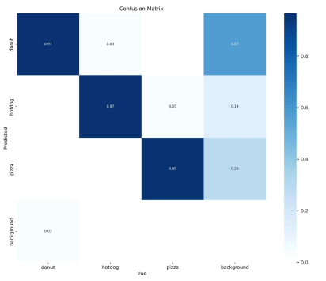
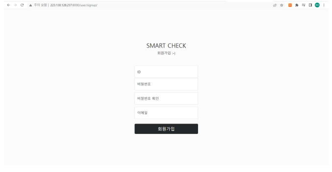
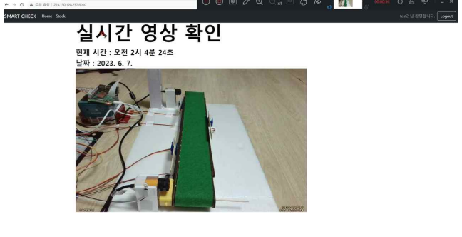
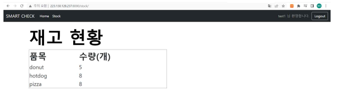
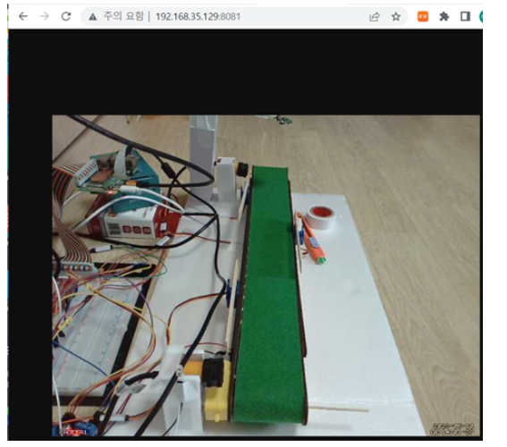
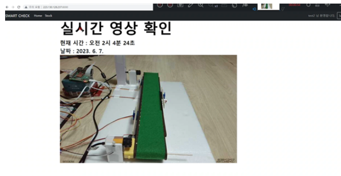

# hongik_challenge

---
#### 프로젝트 주제
- 이미지 학습을 통해 컨베이어 벨트 위의 물건을 자동으로 분류하는 모형 및 시스템 제작
 

### 프로젝트 기간
- 2023.3 ~ 2023.6
- 4학년 1학기 홍익챌린지 프로젝트
 

---

#### 프로젝트 배경
코로나 이후로 지난 몇 년간 소비자들의 온라인 소비는 폭발적으로 증가하였습니다. 요즘 인터넷으로 물건을 시키면 원하는 배송 시간까지 정할수 있고 로켓 배송, 새벽 배송등 당일배송을 하는 경우도 흔합니다. 이런 사정 속에서 고객은 더 이상 상품의 가격과 질 뿐만 아니라 배송 품질까지 비교하여 제품을 구매하곤 합니다. 따라서 물류 서비스를 제공하는 기업은 이런 다양한 소비자의 수요를 맞출 수 있는 체계를 갖추지 못한다면 향후 시장에서 살아남기 힘들 것입니다. 기존의 물류 시스템이 갖는 문제점을 IT 기술을 이용하여 해소가 가능합니다. 

 
---

#### 프로젝트 수행 내용 

##### 1) 라즈베리파이와 센서 학습 및 모형 제작
- 모형 제작 재료 : 라즈베리파이, GPIO 확장핀, 브레드보드, LED, 컨베이어벨트, 서브 모터, USB 웹캠,
                  라즈베리파이 카메라, 적외선 센서, DC 모터, 모터 드라이브, 터미널 변환기

- 라즈베리파이, GPIO 확장핀, 브레드보드 : 센서 연결 및 조작
- 서브모터 : 물건 분류 시 이동시켜줌
- 라즈베리파이 카메라 : 이미지 분류를 위한 사진을 찍는 역할
- USB 웹캠 : 실시간 모니터링
- 적외선 센서 : 컨베이어벨트 위의 물건 인식을 위한 센서
- DC 모터 : 컨베이벨트를 돌아가게 하는 모터
- 모터 드라이버 : DC 모터의 속도, 방향 조절 역할
- 터미널 변환기 : 모터 드라이버에 안정된 전원 공급 역할
- LED : 오류 상황 발생시 알림을 주기 위

 

##### 2) 이미지 분류 모델 제작
- kaggle에서 패스트푸드 dataset 사용
- roboflow에서 핫도그, 도넛, 피자 데이터를 각각 120장씩 labeling
- train data : test data = 8 : 2
- 정확도를 위해 train 데이터를 증식
- yolov5s 모델 이용 : yolo5s.yaml에서 nc를 3으로 수정, img_size = 426, batch = 8, epoch = 50

 
  -> 모델 정확도 cofusion matrix

 

##### 3) 서버, DB 구축 및 연동 웹페이지 제작
- 네이버 클라우드 플랫폼에서 서버 대여, 공인 ip 주소 할당 및 연결
- Django를 이용하여 웹페이지 제작, DB는 MYSQL 이용
- 재고 파악 기능을 위한 stock app 제작
- MYSQL work bench 사용, stock 테이블 생성, product_name과 product_count로 구성

- 로그인 및 회원가입

- 메인 페이지 : 실시간 영상과 함께 현재 시각과 날짜 확인 가능

- 재고 현황 페이지 : 현재 재고 table에 있는 품목과 수량 확인 가능

 

##### 4) MQTT 통신
- MQTT 통신을 위해 브로커는 mosquitto 사용
- 센서의 정보를 서버에서 알 수 있도록 각 토픽을 만들어 구독하도록 함
    - camera 토픽 : 라즈베리파이 카메라가 물건의 사진을 찍을 때
    - aimodel 토픽 : yolov5 모델의 이미지를 통한 예측이 끝나 결과가 나올 때
    - dcmotor : dc 모터 제어, 컨베이어벨트를 멈추거나 다시 돌릴 때
    - infra : 적외선 센서에 물건이 감지될 때
    - servo : 서브 모터 제어
   
  
- MQTT 통신 연결을 위한 start.py 제작
    - 브로커가 있는 ip주소와 포트 번호를 적어 브로커와 연결
    - 연결에 성공하면 on_connect에서 토픽을 구독하고, on_message에서 구독한 토픽에서 메시지가 오면 디코딩한 후 원하는 동작을 실행하도록 함.
 
 

##### 5) 실시간 스트리밍 기능
- 라즈베리파이의 motion을 사용하여 구현
- 라즈베리파이의 8081 포트에서 확인 가능  
- 라즈베리파이 8081포트
  - ncloud 서버에서 만든 웹사이트 html의 img 태그에 라즈베리파이 8081포트 연결
 

- 실시간 스트리밍 페이지
   

##### 6) 센서 제어를 위한 python 코드
- 모든 센서들의 기능을 class 형태로 정의
- aicamera.py : 라즈베리파이 카메라 제어
- dcmotor.py : dc모터 제어
- infraredray_sensor.py : 적외선 센서 제어
- led_control.py : LED 제어
- servo_motor.py : 서보 모터 제어
- start.py : 모든 센서 python 파일 import, mqtt 연결, 각 메세지마다의 다음 과정을 지정, DB연결 (이 파일만 돌리면 됨)
  - 설명 :
      a. 가장 먼저 MQTT 클래스가 호출되면 DC 모터를 동작하여 컨베이어벨트가 움직이고, 적외선 센서도 작동
      b. 컨베이어 벨트 위의 물건이 움직이다 적외선 센서에 감지되면 dcmotor(토픽)에 이벤트 인자를 stop으로 보내서 컨베이어 벨트 멈춤
      c. infra(토픽)의 첫번째 적외선 센서의 물체 감지 신호를 받으면 라즈베리파이 캠이 작동하여 사진을 찍고 지정된 파일에 저장한 후 aimodel(토픽)에 메시지를 보냄
      d. aimodel(토픽)에 메시지가 오면 이미지 분류 모델은 가장 최근에 저장된 사진을 가져와 분류 시작, 결과가 나오면 servo(토픽)에 메시지를 보냄.
      e. servo(토픽)에 보낸 결과에 맞게 서보 모터가 작동하고 dcmotor(토픽)에 메시지 전송
      f. dcmotor(토픽)에 메시지가 오면 다시 컨베이어벨트가 작동하고 물건 분류
      g. 물건이 분류되어 컨베이어벨트에서 떨어지면 서보 모터는 다시 제자리로 돌아가고 infra(토픽)에 end 신호를 주어 적외선 센서가 다시 작동하면서 1~7과정 반복
      h. 분류가 끝나면 aimodel(토픽)의 메시지로 왔던 분류 결과를 토대로 DB에 접속하여 해당 품목의 수량을 +1 함.
        - 예외 : 만약 물체가 컨베이어 벨트 중간으로 들어오거나 분류가 되지 않아 컨베이어벨트의 마지막까지 간다면 마지막에 달려있는 적외선 센서가 감지하면서 오류 상황임을 인식,
                 컨베이어 벨트 작동을 멈추고 LED가 켜짐
 

---

#### 프로젝트 수행 중 발생된 문제와 해결 방안
1. 웹과 브로커 연결 오류
  - 문제 : 초기에는 웹 페이지에서 실시간 스트리밍을 구현하기 위해 MQTT 통신을 이용하여 라즈베리파이에 연결된 카메라가 찍는 사진을 가져와 영상으로 구현하려 함.
           그러나 외부 서버에서 브로커로 연결이 계속 실패.

  - 원인 : 외부 접속을 허용해도 실패했었는데 찾아보니 웹과 브로커의 통신은 웹 소켓 통신을 이용하기 때문에 연결이 되지 않았던 것.
  
  - 해결 방안 : 브로커로 사용하는 mosquitto에는 웹 소켓도 사용할 수 있었기 때문에 mosquitto.conf 파일에 웹 소켓 프로토콜과 포트 번호를 연결하였더니 브로커와의 연결에 성공.
 

2. MQTT를 이용한 실시간 스트리밍 기능

    - 문제 : MQTT통신을 이용하여 전송된 payloaDBytes는 unit8array 형식으로 받아지기 때문에 btoa 메소드를 이용하여 base64로 인코딩해야 함.
             하지만 스트리밍이 될 때도 있고 안될 때도 있었음. 그리고 되더라도 지연이 굉장히 심함.
      
    - 원인 : 오류를 콘솔 창에 출력해보니 call stack이 초과하였다는 에러가 출력. 원인을 예상했을 때 라즈베리파이 캠에서 촬영된 사진이 빠른 속도로 넘어와 on_message 함수를 호출하는데 이미지로 변환하기               위한 인코딩이 너무 오래 걸려 call stack에 호출된 함수가 감당할 수 없을 만큼 쌓인다고 판단.
      
    - 해결방안 : 로컬 내에서는 좀 더 빠르게 스트리밍할 수 있다는 점을 깨달아 라즈베리파이 내부에서 스트리밍하기로 함.
                 motion이라는 라이브러리를 사용, 라즈베리파이 안의 8081 포트를 스트리밍하는 페이지로 사용하기 위해 포트 포워딩을 이용.
                 하지만 이 플젝은 따로 구축한 서버의 웹사이트에서 구현되어야 하므로 메인 페이지의 html 파일의 실시간 스트리밍을 하는 이미지 태그의 SRC를 라즈베리파이의 8081번으로 지정하여
                 기능을 구현. 하지만 여기서 한 번 더 오류가 발생했는데 Chrome CORS 에러가 발생. 공인 IP가 아닌 IP 주소에서 데이터를 가져와 발생하는 문제라고 하는데,
                 Block insecure private network request 항목의 설정값을 disabled로 설정하였더니 해결 함
 

3. 모형의 자동 반복

    - 문제 : 계속 작동하는 것이 아닌 한 번 작동하고 나면 정지함
    - 원인 : 적외선 센서가 한 번 물체를 감지하면 다음 동작을 위해 꺼지게 되는데 분류가 완료된 후에 다시 켜지 않아 반복되지 않았던 것
    - 해결 방안 : 모델이 분류를 끝내는 신호와 동시에 적외선 센서를 다시 동작하도록 함.
                 하지만 여러 센서를 제어하기 위해 스레드를 이용하여 일을 병렬적으로 처리하기 때문에 분류된 물체가 적외선 센서를 벗어나기도 전에 적외선 센서가 동작하여
                 이미 분류된 물체를 또 감지하는 오류 발생
                 그래서 물체가 컨베이어벨트에서 떨어지고 서보 모터가 제자리로 돌아오고 난 후 신호를 보내도록 함.
                 한 번의 동작이 완전히 끝났다는 신호가 오면 다시 적외선 센서가 동작하도록 하여 전체 동작을 다시 반복할 수 있도록 함.
 
      
4. 분류된 물건의 수량 DB에 자동 반영 처음에는 스마트 물류 시스템 모형이 물건을 분류하고 그 결과를 mqtt로 웹과 공유하여 서버의 DB를 수정하려고 함

    - 문제 : 통신이 안되서 반영이 안됨
    - 원인 : 웹 페이지를 구동하고 있지 않으면 웹이 브로커와 연결되어 있지 않기 때문에 DB에 변경 사항이 반영되지 않는 점
    - 해결방안 : 라즈베리파이에서 직접 서버의 DB에 접속하여 재고를 변경하는 방법으로 변경.
                그래서 센서를 제어하는 파일의 하단에 서보 모터가 물건 분류를 위해 작동하면 분류하는 물건의 수량을 하나 올리는 방식으로 수정하여 해결
 

---

#### 프로젝트 시연 영상
[스마트 물류 시스템_시연.zip](https://github.com/user-attachments/files/18330796/_.zip)

